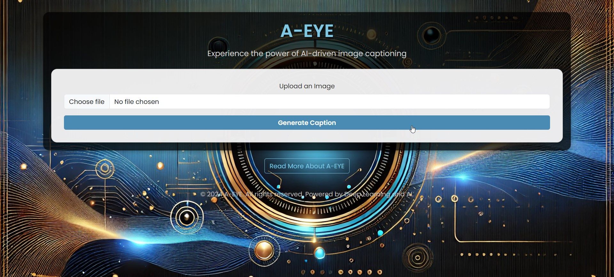
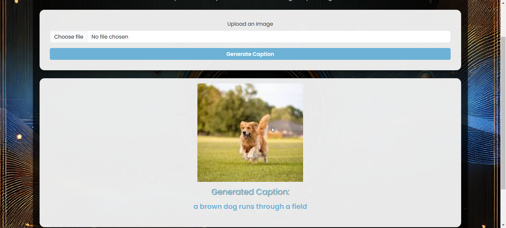

# A-EYE: Intelligent Captioning

A-EYE is an intelligent image captioning tool that leverages deep learning to generate meaningful and accurate descriptions for uploaded images. Designed with simplicity and user-friendliness in mind, A-EYE provides an effortless way to understand visual content.

## Features

- **AI-Powered Image Captioning**: Generates descriptive captions for uploaded images using state-of-the-art AI models.
- **Responsive UI**: Built with Bootstrap to ensure a seamless user experience across devices.
- **Audio Playback**: Generated captions are read aloud for accessibility.
- **Interactive Design**: Offers a sleek, modern design which is easy to use.

## Technologies Used

- **Frontend**:
  - HTML5
  - CSS (inline styles using Bootstrap)
  - JavaScript (for interactivity and speech synthesis)
- **Backend**:
  - Flask (Python framework for server-side rendering)
  - Deep learning model for image captioning
- **Deployment**:
  - Static assets (images, uploads) served via Flask

## How It Works

1. Upload an image by clicking upload button.
2. The backend processes the image using a pre-trained deep learning model.
3. The generated caption is displayed and played as audio.
4. Users can learn more about the project via the "About" section.

## Installation Instructions

1. Clone the repository:
   ```bash
   git clone https://github.com/ashwanikrs/a-eye.git
   cd a-eye
   ```

2. Install dependencies:
   ```bash
   pip install -r requirements.txt
   ```

3. Run the application:
   ```bash
   python app.py
   ```

4. Open your browser and navigate to:
   ```
   http://127.0.0.1:5000/
   ```

## File Structure

```
A-EYE/
├── static/
│   ├── images/
│   │   ├── bg2.jpg
│   │   ├── fav.jpg
│   └── uploads/
├── templates/
│   ├── index.html
├── app.py
├── requirements.txt
└── README.md
```


### Main Interface


### Generated Caption Example


## Future Enhancements

- Add support for multiple languages in caption generation.
- Implement user authentication for personalized experiences.
- Enable drag-and-drop image upload functionality.

## License

This project is licensed under the MIT License. Feel free to use, modify, and distribute this project as needed.

## Contributing

Contributions are welcome! To contribute:

1. Fork the repository.
2. Create a new branch for your feature or bug fix.
3. Commit your changes and push them to your fork.
4. Submit a pull request describing your changes.

---


